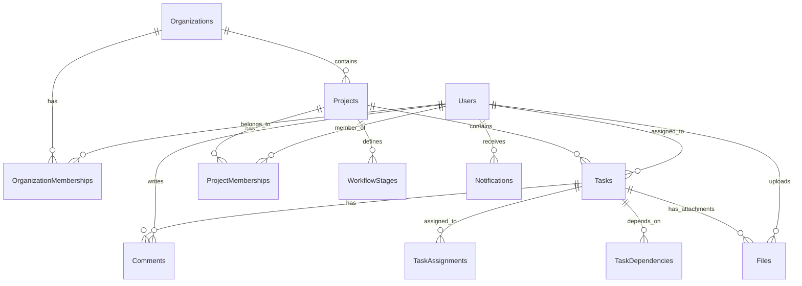

# Data Model and Database Schema

This document defines the complete data model for the Collaborative Task Management Platform, including database schema, relationships, and data flow.

## 📊 Database Schema Overview

The data model is designed to support multi-tenant architecture, real-time collaboration, and complex project workflows while maintaining data integrity and performance.

### Core Design Principles

1. **Multi-Tenancy**: All data is scoped to organizations for isolation
2. **Audit Trail**: All critical actions are logged for compliance
3. **Soft Deletes**: Important data is marked as deleted rather than removed
4. **Timestamps**: All records include creation and update timestamps
5. **Extensibility**: Custom fields and metadata support future requirements

## 🗄️ Complete Database Schema

### Users and Authentication

```sql
-- Users table - core user information
CREATE TABLE users (
    id UUID PRIMARY KEY DEFAULT gen_random_uuid(),
    email VARCHAR(255) UNIQUE NOT NULL,
    email_verified BOOLEAN DEFAULT FALSE,
    name VARCHAR(255) NOT NULL,
    avatar_url TEXT,
    timezone VARCHAR(50) DEFAULT 'UTC',
    locale VARCHAR(10) DEFAULT 'en',
    created_at TIMESTAMP WITH TIME ZONE DEFAULT NOW(),
    updated_at TIMESTAMP WITH TIME ZONE DEFAULT NOW(),
    last_login_at TIMESTAMP WITH TIME ZONE,
    deleted_at TIMESTAMP WITH TIME ZONE -- Soft delete
);

-- User preferences and settings
CREATE TABLE user_preferences (
    user_id UUID PRIMARY KEY REFERENCES users(id) ON DELETE CASCADE,
    theme VARCHAR(20) DEFAULT 'light', -- light, dark, auto
    language VARCHAR(10) DEFAULT 'en',
    timezone VARCHAR(50) DEFAULT 'UTC',
    email_notifications BOOLEAN DEFAULT TRUE,
    push_notifications BOOLEAN DEFAULT TRUE,
    notification_frequency VARCHAR(20) DEFAULT 'immediate', -- immediate, hourly, daily
    created_at TIMESTAMP WITH TIME ZONE DEFAULT NOW(),
    updated_at TIMESTAMP WITH TIME ZONE DEFAULT NOW()
);

-- Authentication sessions
CREATE TABLE accounts (
    id UUID PRIMARY KEY DEFAULT gen_random_uuid(),
    user_id UUID NOT NULL REFERENCES users(id) ON DELETE CASCADE,
    type VARCHAR(50) NOT NULL, -- oauth, email, credential
    provider VARCHAR(50) NOT NULL, -- google, microsoft, email
    provider_account_id VARCHAR(255) NOT NULL,
    refresh_token TEXT,
    access_token TEXT,
    expires_at TIMESTAMP WITH TIME ZONE,
    token_type VARCHAR(50),
    scope TEXT,
    id_token TEXT,
    session_state TEXT,
    created_at TIMESTAMP WITH TIME ZONE DEFAULT NOW(),
    updated_at TIMESTAMP WITH TIME ZONE DEFAULT NOW(),
    UNIQUE(provider, provider_account_id)
);

-- User sessions for active logins
CREATE TABLE sessions (
    id UUID PRIMARY KEY DEFAULT gen_random_uuid(),
    user_id UUID NOT NULL REFERENCES users(id) ON DELETE CASCADE,
    session_token VARCHAR(255) UNIQUE NOT NULL,
    expires TIMESTAMP WITH TIME ZONE NOT NULL,
    user_agent TEXT,
    ip_address INET,
    created_at TIMESTAMP WITH TIME ZONE DEFAULT NOW(),
    updated_at TIMESTAMP WITH TIME ZONE DEFAULT NOW()
);
```

### Organizations and Teams

```sql
-- Organizations/Companies
CREATE TABLE organizations (
    id UUID PRIMARY KEY DEFAULT gen_random_uuid(),
    name VARCHAR(255) NOT NULL,
    slug VARCHAR(255) UNIQUE NOT NULL,
    description TEXT,
    logo_url TEXT,
    website VARCHAR(255),
    plan VARCHAR(50) DEFAULT 'free', -- free, pro, enterprise
    settings JSONB DEFAULT '{}',
    created_at TIMESTAMP WITH TIME ZONE DEFAULT NOW(),
    updated_at TIMESTAMP WITH TIME ZONE DEFAULT NOW(),
    deleted_at TIMESTAMP WITH TIME ZONE
);

-- Organization memberships
CREATE TABLE organization_memberships (
    id UUID PRIMARY KEY DEFAULT gen_random_uuid(),
    user_id UUID NOT NULL REFERENCES users(id) ON DELETE CASCADE,
    organization_id UUID NOT NULL REFERENCES organizations(id) ON DELETE CASCADE,
    role VARCHAR(50) NOT NULL, -- owner, admin, member, viewer
    invited_by UUID REFERENCES users(id),
    invited_at TIMESTAMP WITH TIME ZONE,
    joined_at TIMESTAMP WITH TIME ZONE DEFAULT NOW(),
    created_at TIMESTAMP WITH TIME ZONE DEFAULT NOW(),
    updated_at TIMESTAMP WITH TIME ZONE DEFAULT NOW(),
    UNIQUE(user_id, organization_id)
);

-- Team structure within organizations
CREATE TABLE teams (
    id UUID PRIMARY KEY DEFAULT gen_random_uuid(),
    organization_id UUID NOT NULL REFERENCES organizations(id) ON DELETE CASCADE,
    name VARCHAR(255) NOT NULL,
    description TEXT,
    parent_team_id UUID REFERENCES teams(id), -- Hierarchical teams
    created_by UUID NOT NULL REFERENCES users(id),
    created_at TIMESTAMP WITH TIME ZONE DEFAULT NOW(),
    updated_at TIMESTAMP WITH TIME ZONE DEFAULT NOW(),
    deleted_at TIMESTAMP WITH TIME ZONE
);

-- Team memberships
CREATE TABLE team_memberships (
    id UUID PRIMARY KEY DEFAULT gen_random_uuid(),
    user_id UUID NOT NULL REFERENCES users(id) ON DELETE CASCADE,
    team_id UUID NOT NULL REFERENCES teams(id) ON DELETE CASCADE,
    role VARCHAR(50) DEFAULT 'member', -- lead, member
    joined_at TIMESTAMP WITH TIME ZONE DEFAULT NOW(),
    created_at TIMESTAMP WITH TIME ZONE DEFAULT NOW(),
    UNIQUE(user_id, team_id)
);
```

### Projects and Workflows

```sql
-- Projects
CREATE TABLE projects (
    id UUID PRIMARY KEY DEFAULT gen_random_uuid(),
    organization_id UUID NOT NULL REFERENCES organizations(id) ON DELETE CASCADE,
    name VARCHAR(255) NOT NULL,
    slug VARCHAR(255) NOT NULL,
    description TEXT,
    status VARCHAR(50) DEFAULT 'active', -- active, archived, completed
    visibility VARCHAR(50) DEFAULT 'private', -- private, public, internal
    color VARCHAR(7), -- Hex color for UI
    icon VARCHAR(50), -- Icon identifier
    template_id UUID REFERENCES projects(id), -- Template reference
    settings JSONB DEFAULT '{}',
    start_date DATE,
    due_date DATE,
    created_by UUID NOT NULL REFERENCES users(id),
    created_at TIMESTAMP WITH TIME ZONE DEFAULT NOW(),
    updated_at TIMESTAMP WITH TIME ZONE DEFAULT NOW(),
    deleted_at TIMESTAMP WITH TIME ZONE,
    UNIQUE(organization_id, slug)
);

-- Project members
CREATE TABLE project_memberships (
    id UUID PRIMARY KEY DEFAULT gen_random_uuid(),
    project_id UUID NOT NULL REFERENCES projects(id) ON DELETE CASCADE,
    user_id UUID NOT NULL REFERENCES users(id) ON DELETE CASCADE,
    role VARCHAR(50) DEFAULT 'member', -- owner, admin, member, viewer
    joined_at TIMESTAMP WITH TIME ZONE DEFAULT NOW(),
    created_at TIMESTAMP WITH TIME ZONE DEFAULT NOW(),
    UNIQUE(project_id, user_id)
);

-- Workflow stages (columns in kanban board)
CREATE TABLE workflow_stages (
    id UUID PRIMARY KEY DEFAULT gen_random_uuid(),
    project_id UUID NOT NULL REFERENCES projects(id) ON DELETE CASCADE,
    name VARCHAR(255) NOT NULL,
    description TEXT,
    color VARCHAR(7),
    position INTEGER NOT NULL,
    is_completed_stage BOOLEAN DEFAULT FALSE,
    created_at TIMESTAMP WITH TIME ZONE DEFAULT NOW(),
    updated_at TIMESTAMP WITH TIME ZONE DEFAULT NOW(),
    UNIQUE(project_id, position)
);

-- Custom fields for projects
CREATE TABLE custom_fields (
    id UUID PRIMARY KEY DEFAULT gen_random_uuid(),
    project_id UUID NOT NULL REFERENCES projects(id) ON DELETE CASCADE,
    name VARCHAR(255) NOT NULL,
    type VARCHAR(50) NOT NULL, -- text, number, date, select, multiselect, boolean
    options JSONB, -- For select/multiselect types
    is_required BOOLEAN DEFAULT FALSE,
    position INTEGER,
    created_at TIMESTAMP WITH TIME ZONE DEFAULT NOW(),
    updated_at TIMESTAMP WITH TIME ZONE DEFAULT NOW()
);
```

### Tasks and Subtasks

```sql
-- Tasks
CREATE TABLE tasks (
    id UUID PRIMARY KEY DEFAULT gen_random_uuid(),
    project_id UUID NOT NULL REFERENCES projects(id) ON DELETE CASCADE,
    parent_task_id UUID REFERENCES tasks(id), -- For subtasks
    title VARCHAR(1000) NOT NULL,
    description TEXT,
    status VARCHAR(50) NOT NULL, -- Maps to workflow stages
    priority VARCHAR(50) DEFAULT 'medium', -- low, medium, high, urgent
    assignee_id UUID REFERENCES users(id),
    reporter_id UUID NOT NULL REFERENCES users(id),
    stage_id UUID REFERENCES workflow_stages(id),
    due_date TIMESTAMP WITH TIME ZONE,
    start_date TIMESTAMP WITH TIME ZONE,
    completed_at TIMESTAMP WITH TIME ZONE,
    estimated_hours INTEGER,
    actual_hours INTEGER,
    position INTEGER, -- For ordering within stages
    custom_fields JSONB DEFAULT '{}',
    tags TEXT[],
    created_at TIMESTAMP WITH TIME ZONE DEFAULT NOW(),
    updated_at TIMESTAMP WITH TIME ZONE DEFAULT NOW(),
    deleted_at TIMESTAMP WITH TIME ZONE
);

-- Task assignments (multiple assignees)
CREATE TABLE task_assignments (
    id UUID PRIMARY KEY DEFAULT gen_random_uuid(),
    task_id UUID NOT NULL REFERENCES tasks(id) ON DELETE CASCADE,
    user_id UUID NOT NULL REFERENCES users(id) ON DELETE CASCADE,
    assigned_at TIMESTAMP WITH TIME ZONE DEFAULT NOW(),
    assigned_by UUID NOT NULL REFERENCES users(id),
    UNIQUE(task_id, user_id)
);

-- Task dependencies
CREATE TABLE task_dependencies (
    id UUID PRIMARY KEY DEFAULT gen_random_uuid(),
    blocker_task_id UUID NOT NULL REFERENCES tasks(id) ON DELETE CASCADE,
    blocked_task_id UUID NOT NULL REFERENCES tasks(id) ON DELETE CASCADE,
    dependency_type VARCHAR(50) DEFAULT 'finish_to_start', -- finish_to_start, start_to_start, etc.
    created_by UUID NOT NULL REFERENCES users(id),
    created_at TIMESTAMP WITH TIME ZONE DEFAULT NOW(),
    UNIQUE(blocker_task_id, blocked_task_id)
);

-- Task watchers
CREATE TABLE task_watchers (
    id UUID PRIMARY KEY DEFAULT gen_random_uuid(),
    task_id UUID NOT NULL REFERENCES tasks(id) ON DELETE CASCADE,
    user_id UUID NOT NULL REFERENCES users(id) ON DELETE CASCADE,
    watching_since TIMESTAMP WITH TIME ZONE DEFAULT NOW(),
    UNIQUE(task_id, user_id)
);

-- Recurring tasks configuration
CREATE TABLE recurring_tasks (
    id UUID PRIMARY KEY DEFAULT gen_random_uuid(),
    task_id UUID NOT NULL REFERENCES tasks(id) ON DELETE CASCADE,
    frequency VARCHAR(50) NOT NULL, -- daily, weekly, monthly, yearly
    interval INTEGER DEFAULT 1, -- Every X days/weeks/months
    days_of_week INTEGER[], -- For weekly: [1,3,5] = Mon,Wed,Fri
    day_of_month INTEGER, -- For monthly: 15 = 15th day
    end_date DATE,
    max_occurrences INTEGER,
    next_occurrence DATE,
    created_at TIMESTAMP WITH TIME ZONE DEFAULT NOW(),
    updated_at TIMESTAMP WITH TIME ZONE DEFAULT NOW()
);
```

### Comments and Communication

```sql
-- Comments and discussions
CREATE TABLE comments (
    id UUID PRIMARY KEY DEFAULT gen_random_uuid(),
    task_id UUID NOT NULL REFERENCES tasks(id) ON DELETE CASCADE,
    author_id UUID NOT NULL REFERENCES users(id),
    content TEXT NOT NULL,
    content_type VARCHAR(50) DEFAULT 'text', -- text, markdown
    parent_comment_id UUID REFERENCES comments(id), -- For threaded comments
    is_edited BOOLEAN DEFAULT FALSE,
    edited_at TIMESTAMP WITH TIME ZONE,
    created_at TIMESTAMP WITH TIME ZONE DEFAULT NOW(),
    updated_at TIMESTAMP WITH TIME ZONE DEFAULT NOW(),
    deleted_at TIMESTAMP WITH TIME ZONE
);

-- Comment reactions
CREATE TABLE comment_reactions (
    id UUID PRIMARY KEY DEFAULT gen_random_uuid(),
    comment_id UUID NOT NULL REFERENCES comments(id) ON DELETE CASCADE,
    user_id UUID NOT NULL REFERENCES users(id) ON DELETE CASCADE,
    emoji VARCHAR(50) NOT NULL,
    created_at TIMESTAMP WITH TIME ZONE DEFAULT NOW(),
    UNIQUE(comment_id, user_id, emoji)
);

-- Comment mentions
CREATE TABLE comment_mentions (
    id UUID PRIMARY KEY DEFAULT gen_random_uuid(),
    comment_id UUID NOT NULL REFERENCES comments(id) ON DELETE CASCADE,
    mentioned_user_id UUID NOT NULL REFERENCES users(id) ON DELETE CASCADE,
    mentioned_by UUID NOT NULL REFERENCES users(id),
    created_at TIMESTAMP WITH TIME ZONE DEFAULT NOW(),
    UNIQUE(comment_id, mentioned_user_id)
);
```

### Files and Attachments

```sql
-- File attachments
CREATE TABLE files (
    id UUID PRIMARY KEY DEFAULT gen_random_uuid(),
    task_id UUID REFERENCES tasks(id) ON DELETE CASCADE,
    project_id UUID REFERENCES projects(id) ON DELETE CASCADE,
    comment_id UUID REFERENCES comments(id) ON DELETE CASCADE,
    uploaded_by UUID NOT NULL REFERENCES users(id),
    filename VARCHAR(255) NOT NULL,
    original_filename VARCHAR(255) NOT NULL,
    mime_type VARCHAR(100) NOT NULL,
    size_bytes BIGINT NOT NULL,
    storage_key VARCHAR(500) NOT NULL, -- S3 object key
    storage_provider VARCHAR(50) DEFAULT 's3',
    thumbnail_key VARCHAR(500), -- For image thumbnails
    description TEXT,
    is_public BOOLEAN DEFAULT FALSE,
    download_count INTEGER DEFAULT 0,
    created_at TIMESTAMP WITH TIME ZONE DEFAULT NOW(),
    updated_at TIMESTAMP WITH TIME ZONE DEFAULT NOW(),
    deleted_at TIMESTAMP WITH TIME ZONE
);

-- File versions
CREATE TABLE file_versions (
    id UUID PRIMARY KEY DEFAULT gen_random_uuid(),
    file_id UUID NOT NULL REFERENCES files(id) ON DELETE CASCADE,
    version_number INTEGER NOT NULL,
    storage_key VARCHAR(500) NOT NULL,
    size_bytes BIGINT NOT NULL,
    uploaded_by UUID NOT NULL REFERENCES users(id),
    change_description TEXT,
    created_at TIMESTAMP WITH TIME ZONE DEFAULT NOW()
);
```

### Notifications and Activity

```sql
-- User notifications
CREATE TABLE notifications (
    id UUID PRIMARY KEY DEFAULT gen_random_uuid(),
    user_id UUID NOT NULL REFERENCES users(id) ON DELETE CASCADE,
    type VARCHAR(100) NOT NULL, -- task_assigned, comment_added, etc.
    title VARCHAR(255) NOT NULL,
    message TEXT,
    data JSONB DEFAULT '{}', -- Additional notification data
    is_read BOOLEAN DEFAULT FALSE,
    read_at TIMESTAMP WITH TIME ZONE,
    created_at TIMESTAMP WITH TIME ZONE DEFAULT NOW()
);

-- Activity feed and audit logs
CREATE TABLE activities (
    id UUID PRIMARY KEY DEFAULT gen_random_uuid(),
    user_id UUID NOT NULL REFERENCES users(id),
    organization_id UUID REFERENCES organizations(id),
    project_id UUID REFERENCES projects(id),
    task_id UUID REFERENCES tasks(id),
    comment_id UUID REFERENCES comments(id),
    action VARCHAR(100) NOT NULL, -- created, updated, deleted, assigned, etc.
    resource_type VARCHAR(50) NOT NULL, -- task, project, comment, etc.
    resource_id UUID NOT NULL,
    old_values JSONB,
    new_values JSONB,
    metadata JSONB DEFAULT '{}',
    ip_address INET,
    user_agent TEXT,
    created_at TIMESTAMP WITH TIME ZONE DEFAULT NOW()
);

-- Notification preferences
CREATE TABLE notification_preferences (
    id UUID PRIMARY KEY DEFAULT gen_random_uuid(),
    user_id UUID NOT NULL REFERENCES users(id) ON DELETE CASCADE,
    project_id UUID REFERENCES projects(id) ON DELETE CASCADE, -- NULL for global preferences
    event_type VARCHAR(100) NOT NULL,
    in_app BOOLEAN DEFAULT TRUE,
    email BOOLEAN DEFAULT FALSE,
    push BOOLEAN DEFAULT FALSE,
    created_at TIMESTAMP WITH TIME ZONE DEFAULT NOW(),
    updated_at TIMESTAMP WITH TIME ZONE DEFAULT NOW(),
    UNIQUE(user_id, project_id, event_type)
);
```

### Search and Analytics

```sql
-- Search index (for full-text search)
CREATE TABLE search_index (
    id UUID PRIMARY KEY DEFAULT gen_random_uuid(),
    document_id UUID NOT NULL, -- Reference to task, project, comment, etc.
    document_type VARCHAR(50) NOT NULL, -- task, project, comment, file
    content_tsvector TSVECTOR,
    metadata JSONB DEFAULT '{}',
    project_id UUID REFERENCES projects(id),
    organization_id UUID REFERENCES organizations(id),
    updated_at TIMESTAMP WITH TIME ZONE DEFAULT NOW()
);

-- Analytics events
CREATE TABLE analytics_events (
    id UUID PRIMARY KEY DEFAULT gen_random_uuid(),
    user_id UUID REFERENCES users(id),
    organization_id UUID REFERENCES organizations(id),
    event_type VARCHAR(100) NOT NULL,
    properties JSONB DEFAULT '{}',
    timestamp TIMESTAMP WITH TIME ZONE DEFAULT NOW(),
    session_id VARCHAR(255),
    ip_address INET
);
```

## 🔍 Indexes for Performance

```sql
-- User indexes
CREATE INDEX idx_users_email ON users(email);
CREATE INDEX idx_users_created_at ON users(created_at);
CREATE INDEX idx_sessions_user_id ON sessions(user_id);
CREATE INDEX idx_sessions_expires ON sessions(expires);

-- Organization indexes
CREATE INDEX idx_organization_memberships_user_id ON organization_memberships(user_id);
CREATE INDEX idx_organization_memberships_org_id ON organization_memberships(organization_id);
CREATE INDEX idx_team_memberships_user_id ON team_memberships(user_id);
CREATE INDEX idx_team_memberships_team_id ON team_memberships(team_id);

-- Project indexes
CREATE INDEX idx_projects_org_id ON projects(organization_id);
CREATE INDEX idx_projects_status ON projects(status);
CREATE INDEX idx_projects_created_at ON projects(created_at);
CREATE INDEX idx_project_memberships_project_id ON project_memberships(project_id);
CREATE INDEX idx_project_memberships_user_id ON project_memberships(user_id);

-- Task indexes
CREATE INDEX idx_tasks_project_id ON tasks(project_id);
CREATE INDEX idx_tasks_assignee_id ON tasks(assignee_id);
CREATE INDEX idx_tasks_status ON tasks(status);
CREATE INDEX idx_tasks_due_date ON tasks(due_date);
CREATE INDEX idx_tasks_created_at ON tasks(created_at);
CREATE INDEX idx_tasks_project_status ON tasks(project_id, status);
CREATE INDEX idx_tasks_parent_task_id ON tasks(parent_task_id);

-- Task relationships
CREATE INDEX idx_task_assignments_task_id ON task_assignments(task_id);
CREATE INDEX idx_task_assignments_user_id ON task_assignments(user_id);
CREATE INDEX idx_task_watchers_task_id ON task_watchers(task_id);
CREATE INDEX idx_task_watchers_user_id ON task_watchers(user_id);

-- Comment indexes
CREATE INDEX idx_comments_task_id ON comments(task_id);
CREATE INDEX idx_comments_author_id ON comments(author_id);
CREATE INDEX idx_comments_created_at ON comments(created_at);
CREATE INDEX idx_comments_parent_comment_id ON comments(parent_comment_id);

-- File indexes
CREATE INDEX idx_files_task_id ON files(task_id);
CREATE INDEX idx_files_project_id ON files(project_id);
CREATE INDEX idx_files_uploaded_by ON files(uploaded_by);
CREATE INDEX idx_files_created_at ON files(created_at);

-- Notification indexes
CREATE INDEX idx_notifications_user_id ON notifications(user_id);
CREATE INDEX idx_notifications_is_read ON notifications(is_read);
CREATE INDEX idx_notifications_created_at ON notifications(created_at);

-- Activity indexes
CREATE INDEX idx_activities_user_id ON activities(user_id);
CREATE INDEX idx_activities_project_id ON activities(project_id);
CREATE INDEX idx_activities_task_id ON activities(task_id);
CREATE INDEX idx_activities_created_at ON activities(created_at);
CREATE INDEX idx_activities_org_id ON activities(organization_id);

-- Search indexes
CREATE INDEX idx_search_index_content ON search_index USING gin(content_tsvector);
CREATE INDEX idx_search_index_document_id ON search_index(document_id);
CREATE INDEX idx_search_index_project_id ON search_index(project_id);
```

## 🔗 Data Flow and Relationships

### Core Entity Relationships



### Data Access Patterns

#### Multi-Tenant Data Isolation
- All queries include organization_id for data isolation
- Row-level security policies enforce tenant boundaries
- Indexes optimize for organization-based queries

#### Performance Optimizations
- Composite indexes for common query patterns
- Partial indexes for filtered queries
- JSONB indexes for custom field searches
- Time-based partitioning for activity logs

#### Caching Strategy
- User sessions cached in Redis
- Frequently accessed project data cached
- Search results cached with TTL
- Real-time data served via WebSockets

## 📊 Data Integrity Constraints

### Business Logic Constraints

```sql
-- Ensure task status maps to valid workflow stage
ALTER TABLE tasks ADD CONSTRAINT valid_stage
    CHECK (stage_id IN (SELECT id FROM workflow_stages WHERE project_id = tasks.project_id));

-- Ensure due date is after start date
ALTER TABLE tasks ADD CONSTRAINT valid_date_range
    CHECK (due_date IS NULL OR start_date IS NULL OR due_date >= start_date);

-- Ensure project slug is URL-safe
ALTER TABLE projects ADD CONSTRAINT valid_slug
    CHECK (slug ~* '^[a-z0-9-]+$');

-- Ensure notification preferences are valid
ALTER TABLE notification_preferences ADD CONSTRAINT valid_event_type
    CHECK (event_type IN ('task_assigned', 'comment_added', 'task_updated', 'project_updated'));
```

### Soft Delete Implementation

```sql
-- Prevent access to soft-deleted records
CREATE OR REPLACE FUNCTION exclude_deleted()
RETURNS TRIGGER AS $$
BEGIN
    IF OLD.deleted_at IS NOT NULL THEN
        RAISE EXCEPTION 'Record has been deleted';
    END IF;
    RETURN OLD;
END;
$$ LANGUAGE plpgsql;

-- Apply to relevant tables
CREATE TRIGGER exclude_deleted_tasks BEFORE UPDATE ON tasks
    FOR EACH ROW EXECUTE FUNCTION exclude_deleted();
```

## 🔐 Security Considerations

### Row-Level Security

```sql
-- Enable RLS on sensitive tables
ALTER TABLE projects ENABLE ROW LEVEL SECURITY;
ALTER TABLE tasks ENABLE ROW LEVEL SECURITY;
ALTER TABLE comments ENABLE ROW LEVEL SECURITY;

-- Organization members can access their organization's data
CREATE POLICY organization_access ON projects
    USING (organization_id IN (
        SELECT organization_id FROM organization_memberships
        WHERE user_id = auth.uid()
    ));
```

### Audit Trail Implementation

All critical actions are logged to the activities table with:
- User identification
- Timestamp and IP address
- Action type and resource affected
- Before/after values for changes
- Additional metadata for context

---

**This data model provides a comprehensive foundation for the Collaborative Task Management Platform, supporting all required features while maintaining performance, security, and scalability.**