# Complete SDD How-To Guide: From Idea to Production Application

This comprehensive step-by-step guide shows you exactly how to use the SDD (Spec-Driven Development) system to create a complete application. Each step includes the precise commands you must enter and what the SDD system will do in response.

## 🎯 Objective
Create a fully functional application using the systematic SDD workflow, from initial idea to production-ready code.

## 📋 Prerequisites
- Claude Code installed and configured
- SDD plugin installed (`claude plugin install sdd@thierry-lemaire-marketplace`)
- Git repository initialized (recommended)
- Clear application idea in mind

---

## 🚀 QUICK REFERENCE: The Complete SDD Workflow

```
1. /sdd.help                    # Get help and understand workflow
2. /sdd.constitution "[principles]"  # Set project principles
3. /sdd.specify "[description]"     # Create detailed specification
4. /sdd.clarify                     # Resolve ambiguities (if needed)
5. /sdd.plan "[tech-stack]"         # Create technical plan
6. /sdd.tasks                       # Generate implementation tasks
7. /sdd.checklist "[types]"         # Create quality checklists
8. /sdd.analyze                     # Analyze consistency (optional)
9. /sdd.implement                   # Execute implementation
```

## 📊 VISUAL WORKFLOW: Complete SDD Process

```mermaid
flowchart TD
    A[🚀 Start SDD Project] --> B[Get Help & Understand Workflow]
    B --> C[/sdd.help/]
    C --> D[🏛️ Define Project Principles]
    D --> E[/sdd.constitution "principles"/]
    E --> F[📋 Create Detailed Specification]
    F --> G[/sdd.specify "description"/]
    G --> H{❓ Clarification Needed?}
    H -->|Yes| I[/sdd.clarify/]
    H -->|No| J[🏗️ Create Technical Plan]
    I --> J
    J --> K[/sdd.plan "tech-stack"/]
    K --> L[📝 Generate Implementation Tasks]
    L --> M[/sdd.tasks/]
    M --> N[✅ Create Quality Checklists]
    N --> O[/sdd.checklist "types"/]
    O --> P{📊 Analyze Consistency?}
    P -->|Yes| Q[/sdd.analyze/]
    P -->|No| R[🚀 Execute Implementation]
    Q --> R
    R --> S[/sdd.implement/]
    S --> T[🎉 Production-Ready Application]

    T --> U{🔄 Evolution Needed?}
    U -->|Yes| V[Start Evolution Workflow]
    U -->|No| W[✅ Project Complete]

    V --> X[See Evolution Workflow Below]

    style A fill:#e1f5fe
    style T fill:#c8e6c9
    style W fill:#c8e6c9
    style H fill:#fff3e0
    style P fill:#fff3e0
    style U fill:#fff3e0
```



---

## 📖 DETAILED STEP-BY-STEP GUIDE

### Step 0: Getting Started with SDD

**What you need to do:**
```bash
# Install SDD plugin (if not already installed)
claude plugin install sdd@marketplace

# Initialize your project directory
mkdir my-awesome-app
cd my-awesome-app

# Initialize Git repository (highly recommended)
git init
```

**SDD System Response:**
- Plugin becomes available in Claude Code
- All `/sdd.*` commands become functional
- Git integration enabled for automatic branch management

---

### Step 1: Understanding the SDD Workflow

**What you must enter:**
```bash
/sdd.help
```

**What SDD does:**
- Displays comprehensive help information
- Shows all available SDD commands
- Explains the workflow sequence
- Provides examples and best practices
- Shows you what each command expects as input

**Expected Output:**
- Complete command reference
- Workflow sequence explanation
- Examples for different project types
- Best practice recommendations

---

### Step 2: Define Project Principles (Constitution)

**What you must enter:**
```bash
/sdd.constitution "KISS principles, modern web technologies, mobile-first design, 90% test coverage, accessibility first, maintainable code"
```

**Alternative constitutions by project type:**

**For Simple Projects:**
```bash
/sdd.constitution "Keep it simple, no external dependencies, fast loading, vanilla JavaScript only"
```

**For Enterprise Projects:**
```bash
/sdd.constitution "Enterprise security standards, scalability first, comprehensive testing, team collaboration, code review required"
```

**For E-commerce Projects:**
```bash
/sdd.constitution "Performance first, SEO optimized, conversion focused, mobile-first, accessible, secure payments"
```

**What SDD does:**
- Creates `CONSTITUTION.md` file with your principles
- Establishes quality standards for your project
- Guides future technical decisions
- Sets benchmarks for success criteria
- Creates evaluation criteria for features

**Expected Output Files:**
```
CONSTITUTION.md              # Your project principles and standards
```

**Pro Tips:**
- Be specific about your technology preferences
- Include quality metrics (test coverage, performance targets)
- Mention important constraints (budget, timeline, team size)
- Reference compliance requirements (GDPR, accessibility, security)

---

### Step 3: Create Detailed Specification

**What you must enter:**
```bash
/sdd.specify "Build a task management application where users can create projects, add tasks with due dates and priorities, assign tasks to team members, track progress with kanban boards, generate reports, and receive email notifications. Include user authentication, role-based permissions, and real-time collaboration features."
```

**Alternative specifications by complexity:**

**Beginner Level:**
```bash
/sdd.specify "Create a simple to-do list app where users can add tasks, mark them complete, and delete them. Tasks should be stored locally and persist between sessions."
```

**Intermediate Level:**
```bash
/sdd.specify "Build a personal finance tracker where users can add income and expenses, categorize transactions, view spending charts, set budgets, and export data to CSV. Include mobile-responsive design and offline functionality."
```

**Advanced Level:**
```bash
/sdd.specify "Develop a collaborative project management platform with real-time updates, team chat, file sharing, time tracking, Gantt charts, resource management, and client portal. Support multiple organizations and advanced reporting."
```

**What SDD does:**
- Analyzes your description and extracts functional requirements
- Creates detailed user stories with acceptance criteria
- Identifies non-functional requirements
- Marks areas needing clarification with `[NEEDS CLARIFICATION]`
- Generates comprehensive specification document
- Creates data model outlines
- Defines success metrics

**Expected Output Files:**
```
specs/001-feature-name/
├── spec.md              # Complete functional specification
├── research.md          # Technical research findings
└── data-model.md        # Database schema and data models
```

**Key Contents of spec.md:**
- Executive summary
- Detailed user stories (as a [user], I want [feature], so that [benefit])
- Functional requirements list
- Non-functional requirements (performance, security, accessibility)
- Acceptance criteria for each feature
- Success metrics and KPIs

**Common [NEEDS CLARIFICATION] Items:**
- User roles and permissions
- Data retention policies
- Integration requirements
- Performance expectations
- Security compliance needs

---

### Step 4: Resolve Specification Ambiguities

**What you must enter:**
```bash
/sdd.clarify
```

**What SDD does:**
- Scans your specification for `[NEEDS CLARIFICATION]` markers
- Asks targeted questions to resolve ambiguities
- Presents multiple choice options where appropriate
- Updates specification with your decisions
- Ensures all requirements are clearly defined

**Example Clarification Questions:**
- "What user roles should be supported? [Admin, Manager, Member, Viewer] or [Custom roles]?"
- "Should the app support real-time collaboration? [Yes, with WebSocket] or [No, manual refresh only]?"
- "What's your preferred authentication method? [Email/password], [OAuth providers], or [Both]?"
- "Should the app work offline? [Full offline support], [Limited offline], or [Online only]?"

**Your Response Format:**
- Answer each question directly
- Choose from provided options or specify custom requirements
- Provide additional context where helpful
- Confirm priorities when asked

**Expected Outcome:**
- Updated specification without clarification markers
- All requirements clearly defined
- Prioritized feature list
- Decisions documented with reasoning

---

### Step 5: Create Technical Implementation Plan

**What you must enter:**
```bash
/sdd.plan "React with TypeScript, Node.js with Express, PostgreSQL database, Redis for caching, Socket.IO for real-time features, AWS for hosting, Docker for deployment"
```

**Alternative technology stacks:**

**Simple/Beginner Stack:**
```bash
/sdd.plan "HTML5, CSS3, vanilla JavaScript, IndexedDB for storage, Netlify for hosting, no build tools required"
```

**Modern Jamstack Stack:**
```bash
/sdd.plan "Next.js with TypeScript, Tailwind CSS, Vercel for hosting, Stripe for payments, Mailgun for emails, Prisma with PostgreSQL"
```

**Enterprise Stack:**
```bash
/sdd.plan "Microservices architecture, React with TypeScript, Node.js, Java Spring Boot, PostgreSQL, MongoDB, Redis, Kafka, Kubernetes, AWS EKS"
```

**Mobile-First Stack:**
```bash
/sdd.plan "React Native with TypeScript, Firebase for backend, Expo for development, Redux for state management, Sentry for error tracking"
```

**What SDD does:**
- Creates detailed technical architecture plan
- Defines component structure and relationships
- Plans database schema and relationships
- Outlines API endpoints and contracts
- Defines development environment setup
- Plans deployment and infrastructure
- Identifies technical risks and mitigations
- Creates development workflow and tools

**Expected Output Files:**
```
specs/001-feature-name/
├── plan.md              # Technical implementation plan
├── research.md          # Updated with technical decisions
└── contracts/           # API contracts and schemas
    └── api.json         # OpenAPI specification
```

**Key Contents of plan.md:**
- System architecture diagram (described in text)
- Technology stack justification
- Component hierarchy and relationships
- Database design with relationships
- API endpoint specifications
- Authentication and security approach
- Performance optimization strategy
- Deployment architecture
- Development environment setup

---

### Step 6: Generate Implementation Tasks

**What you must enter:**
```bash
/sdd.tasks
```

**What SDD does:**
- Analyzes your specification and technical plan
- Breaks down the entire project into 25 actionable tasks
- Organizes tasks by dependencies (what must be done first)
- Estimates effort and complexity for each task
- Creates logical development phases
- Identifies parallel work opportunities
- Generates task assignment suggestions

**Expected Output Files:**
```
specs/001-feature-name/
└── tasks.md             # 25 dependency-organized tasks
```

**Task Organization:**
- **Phase 1: Foundation** (Tasks 1-5) - Setup, database, authentication
- **Phase 2: Core Features** (Tasks 6-15) - Main functionality
- **Phase 3: Advanced Features** (Tasks 16-22) - Enhanced capabilities
- **Phase 4: Polish & Deploy** (Tasks 23-25) - Testing, deployment, documentation

**Example Task Structure:**
```
# Task 1: Project Setup and Configuration
**Effort**: 2 hours | **Dependencies**: None
- Initialize React project with TypeScript
- Configure development environment
- Set up testing framework
- Establish CI/CD pipeline

# Task 2: Database Design and Implementation
**Effort**: 4 hours | **Dependencies**: Task 1
- Design database schema
- Set up PostgreSQL connection
- Implement migration scripts
- Create seed data
```

---

### Step 7: Create Quality Assurance Checklists

**What you must enter:**
```bash
/sdd.checklist "requirements, UX, performance, accessibility, security"
```

**Alternative checklist options:**
```bash
/sdd.checklist "all"                    # Complete checklists for everything
/sdd.checklist "requirements, testing"  # Focus on validation
/sdd.checklist "performance, security"  # Focus on production readiness
```

**What SDD does:**
- Creates comprehensive quality checklists for each specified area
- Generates testing procedures and validation steps
- Creates acceptance criteria for each feature
- Establishes performance benchmarks
- Defines security audit procedures
- Creates accessibility testing guidelines

**Expected Output Files:**
```
specs/001-feature-name/checklists/
├── requirements.md      # Requirements validation checklist
├── ux.md               # User experience testing checklist
├── performance.md      # Performance benchmarks and testing
├── accessibility.md    # Accessibility compliance checklist
└── security.md         # Security validation checklist
```

**Each Checklist Contains:**
- Pre-development validation questions
- Development milestone checks
- User acceptance testing procedures
- Performance benchmark criteria
- Security validation steps
- Post-deployment monitoring requirements

---

### Step 8: Analyze Consistency (Optional but Recommended)

**What you must enter:**
```bash
/sdd.analyze
```

**What SDD does:**
- Cross-references specification, plan, and constitution
- Identifies contradictions or misalignments
- Validates that technical plan supports all requirements
- Checks that constitution principles are followed
- Identifies missing components or gaps
- Provides consistency score and recommendations

**Expected Output:**
- Consistency analysis report
- Identified issues and resolutions
- Recommendations for improvements
- Validation that all pieces work together

---

### Step 9: Execute Implementation

**What you must enter:**
```bash
/sdd.implement
```

**What SDD does:**
- Executes all 25 tasks in dependency order
- Creates Git branches for feature development (if Git enabled)
- Generates all necessary code files
- Implements database schemas
- Creates API endpoints
- Builds user interfaces
- Implements business logic
- Runs quality checklists
- Provides progress updates

**Expected Output:**
- Complete application codebase
- Git repository with proper branch structure
- All source files, configurations, and documentation
- Running application (if dependencies permit)
- Deployment-ready artifacts

**Generated Application Structure:**
```
my-awesome-app/
├── src/                    # Application source code
├── public/                 # Static assets
├── tests/                  # Test files
├── docs/                   # Documentation
├── config/                 # Configuration files
├── scripts/                # Build and deployment scripts
├── .env.example           # Environment variables template
├── package.json           # Dependencies and scripts
├── README.md              # Application documentation
└── Makefile               # Development automation
```

---

## 🎯 COMPLETE EXAMPLE: Building a Task Management App

Let's walk through a complete example from start to finish.

### Project Idea:
A collaborative task management application for small teams.

### Step-by-Step Execution:

**Step 1: Get Help**
```bash
/sdd.help
```

**Step 2: Set Constitution**
```bash
/sdd.constitution "Modern web technologies, real-time collaboration, mobile-first design, intuitive UX, 95% test coverage, accessible to WCAG 2.1 AA standards, scalable to 1000 concurrent users"
```

**Step 3: Create Specification**
```bash
/sdd.specify "Build a task management app where teams can create projects, add tasks with assignees and due dates, organize tasks in kanban columns, comment on tasks, upload files, and track time. Include user authentication, team invitations, activity feeds, and email notifications."
```

**Step 4: Clarify Requirements**
```bash
/sdd.clarify
```
*Answer questions about user roles, notification preferences, file storage limits, etc.*

**Step 5: Technical Planning**
```bash
/sdd.plan "React with TypeScript, Next.js for SSR, Tailwind CSS for styling, Prisma with PostgreSQL, Socket.IO for real-time, AWS S3 for file storage, Resend for emails, Vercel for hosting"
```

**Step 6: Generate Tasks**
```bash
/sdd.tasks
```

**Step 7: Create Checklists**
```bash
/sdd.checklist "all"
```

**Step 8: Analyze Consistency**
```bash
/sdd.analyze
```

**Step 9: Implement**
```bash
/sdd.implement
```

### Expected Final Result:
A complete, production-ready task management application with:
- User authentication and team management
- Real-time kanban boards
- Task assignments and due dates
- File uploads and comments
- Time tracking and reporting
- Email notifications
- Mobile-responsive design
- 95% test coverage
- Accessibility compliance
- Deployed to Vercel with proper CI/CD

---

## ⚡ PRO TIPS FOR SUCCESS

### Before You Start:
1. **Clear Vision**: Have a clear idea of what you want to build
2. **Know Your Constraints**: Budget, timeline, team size, technical skills
3. **Research Existing Solutions**: Understand your competitive landscape
4. **Define Success**: Know what makes your project successful

### During Specification:
1. **Be Specific**: Vague requirements lead to ambiguous implementations
2. **Think Users**: Focus on user needs and pain points
3. **Prioritize Features**: Must-have vs nice-to-have
4. **Consider Edge Cases**: What happens when things go wrong?

### During Planning:
1. **Match Technology to Requirements**: Don't choose tech just because it's trendy
2. **Consider Your Team**: Use technologies your team knows or can learn quickly
3. **Plan for Growth**: Build architecture that scales with your needs
4. **Budget Realistically**: Consider development and maintenance costs

### During Implementation:
1. **Follow the Task Order**: Dependencies exist for a reason
2. **Test Continuously**: Don't wait until the end to test
3. **Commit Often**: Save your progress regularly
4. **Ask Questions**: Use `/sdd.help` whenever you're unsure

### Common Pitfalls to Avoid:

❌ **Vague Specifications**: "Build a social media app"
✅ **Specific Requirements**: "Build a photo-sharing app for photographers with portfolio management and client galleries"

❌ **Over-Engineering**: Using microservices for a simple todo app
✅ **Appropriate Complexity**: Match technology to project needs

❌ **Skipping Clarification**: Ignoring `[NEEDS CLARIFICATION]` markers
✅ **Thorough Analysis**: Resolve all ambiguities before implementation

❌ **Missing Quality Steps**: Skipping checklists and analysis
✅ **Complete Workflow**: Follow all 9 steps for best results

---

## 📊 SUCCESS METRICS

Your SDD workflow is successful when:

### Specification Quality:
- ✅ All user stories have clear acceptance criteria
- ✅ No `[NEEDS CLARIFICATION]` markers remain
- ✅ Requirements are measurable and testable
- ✅ Success metrics are defined

### Technical Plan Quality:
- ✅ Technology choices justify requirements
- ✅ Architecture scales with expected load
- ✅ Security and performance are addressed
- ✅ Development workflow is efficient

### Implementation Quality:
- ✅ All tasks completed in dependency order
- ✅ Code follows constitution principles
- ✅ All quality checklists pass
- ✅ Application meets specification requirements

### Final Outcome:
- ✅ Working application that solves the stated problem
- ✅ Code is maintainable and well-documented
- ✅ Application is ready for production use
- ✅ Users find value in the solution

---

## 🆘 TROUBLESHOOTING

### Common Issues and Solutions:

**Problem**: Command not found
```bash
/sdd.any-command
# Error: Command not found
```
**Solution**: Ensure SDD plugin is installed
```bash
claude plugin install sdd@marketplace
```

**Problem**: Vague specification leads to poor plan
**Solution**: Be more specific in your `/sdd.specify` command, include detailed user stories and acceptance criteria

**Problem**: Technology plan doesn't match requirements
**Solution**: Re-run `/sdd.plan` with more appropriate technology choices based on your specific requirements

**Problem**: Implementation fails on dependencies
**Solution**: Ensure all required tools are installed (Node.js, database, etc.) before running `/sdd.implement`

**Problem**: Generated code doesn't meet expectations
**Solution**: Review and refine your specification, then re-run the workflow from `/sdd.specify`

---

## 🔄 APPLICATION EVOLUTION & MODIFICATION

Your application is complete, but software development is an ongoing process. SDD provides a structured approach to evolving and modifying your application over time.

### 📊 VISUAL EVOLUTION WORKFLOW

```mermaid
flowchart TD
    A[🔄 Evolution Needed] --> B[📋 Review Existing Artifacts]
    B --> C[cat CONSTITUTION.md]
    C --> D[ls specs/ & review]
    D --> E[🌿 Create Feature Branch]
    E --> F[git checkout -b feature/XXX-evolution]

    F --> G[📝 Specify Evolution]
    G --> H[/sdd.specify "new feature"/]
    H --> I{❓ Integration Questions?}
    I -->|Yes| J[/sdd.clarify/]
    I -->|No| K[🏗️ Plan Integration]
    J --> K

    K --> L[/sdd.plan "integration stack"/]
    L --> M[📋 Generate Evolution Tasks]
    M --> N[/sdd.tasks/]
    N --> O[✅ Create Integration Checklists]
    O --> P[/sdd.checklist "integration,security"/]

    P --> Q{📊 Impact Analysis?}
    Q -->|Yes| R[/sdd.analyze/]
    Q -->|No| S[🚀 Implement Evolution]
    R --> S

    S --> T[/sdd.implement/]
    T --> U[🧪 Comprehensive Testing]
    U --> V[✅ Evolution Complete]

    V --> W{🔄 More Evolution?}
    W -->|Yes| X[🔄 Continuous Cycle]
    W -->|No| Y[📊 Monitor & Gather Feedback]

    X --> A
    Y --> Z[🎓 Next Evolution Planning]
    Z --> A

    style A fill:#e1f5fe
    style V fill:#c8e6c9
    style Y fill:#fff3e0
    style I fill:#fff3e0
    style Q fill:#fff3e0
    style W fill:#fff3e0
```



### 🎯 When to Use SDD for Evolution

**Use SDD for:**
- ✅ Adding new major features
- ✅ Significant architecture changes
- ✅ Breaking changes to existing functionality
- ✅ Performance overhauls
- ✅ Security upgrades
- ✅ Major UI/UX redesigns
- ✅ Adding new user types or roles

**Skip SDD for:**
- ❌ Simple bug fixes
- ❌ Minor text changes
- ❌ Style tweaks
- ❌ Configuration adjustments
- ❌ Small utility functions

### 📋 Evolution Workflow: Modifying Existing Applications

#### Step 1: Prepare Your Workspace
```bash
# Switch to your main branch
git checkout main

# Pull latest changes
git pull origin main

# Create a new feature branch
git checkout -b feature/002-new-feature-name

# Navigate to your project directory
cd your-app-directory
```

#### Step 2: Review Existing SDD Artifacts
```bash
# Review your current constitution
cat CONSTITUTION.md

# Check existing specifications
ls specs/
cat specs/001-original-feature/spec.md

# Review current technical plan
cat specs/001-original-feature/plan.md
```

#### Step 3: Create New Specification for Evolution
```bash
# Add new feature or modification
/sdd.specify "Add real-time chat functionality to existing task management app with message history, typing indicators, read receipts, and file sharing capabilities. Integrate with existing user authentication and project permissions."
```

#### Step 4: Clarify Integration Requirements
```bash
/sdd.clarify
```
*Common clarification questions for evolution:*
- How does new feature integrate with existing user roles?
- Should it use existing database or new tables?
- Does it need to work with existing UI components?
- How does it affect current performance?

#### Step 5: Update Technical Plan
```bash
/sdd.plan "Extend existing React/Next.js architecture with Socket.IO for real-time, add Redis for session management, integrate with existing PostgreSQL database, reuse existing authentication system"
```

#### Step 6: Generate Evolution Tasks
```bash
/sdd.tasks
```

#### Step 7: Create Integration Checklists
```bash
/sdd.checklist "requirements, integration, performance, security"
```

#### Step 8: Analyze Evolution Impact
```bash
/sdd.analyze
```

#### Step 9: Implement Evolution
```bash
/sdd.implement
```

### 🏗️ Evolution Scenarios and Commands

#### Scenario A: Adding New Feature Module
**Project**: E-commerce platform
**Evolution**: Add customer review system

```bash
# 1. Create feature branch
git checkout -b feature/002-customer-reviews

# 2. Specify new feature
/sdd.specify "Add customer review system with star ratings, text reviews, photo uploads, helpful voting, and moderation tools. Integrate with existing product catalog and user accounts."

# 3. Technical planning for integration
/sdd.plan "Extend existing React components, add review tables to PostgreSQL, implement admin moderation dashboard, integrate with existing user authentication"

# 4. Generate implementation tasks
/sdd.tasks

# 5. Execute implementation
/sdd.implement
```

#### Scenario B: Major Architecture Upgrade
**Project**: Task management app
**Evolution**: Migrate from REST API to GraphQL

```bash
# 1. Create architecture branch
git checkout -b feature/003-graphql-migration

# 2. Specify migration requirements
/sdd.specify "Migrate from REST API to GraphQL with Apollo Client. Maintain all existing functionality, improve query efficiency, add real-time subscriptions, implement proper caching strategy."

# 3. New architecture planning
/sdd.plan "Implement GraphQL server with Apollo Server, migrate all REST endpoints to GraphQL resolvers, update React components to use Apollo Client, add subscription support for real-time features"

# 4. Generate migration tasks
/sdd.tasks

# 5. Execute migration
/sdd.implement
```

#### Scenario C: Performance Enhancement
**Project**: Portfolio website
**Evolution**: Optimize for Core Web Vitals

```bash
# 1. Create performance branch
git checkout -b feature/004-performance-optimization

# 2. Specify performance goals
/sdd.specify "Optimize website for Core Web Vitals with LCP < 2.5s, FID < 100ms, CLS < 0.1. Implement lazy loading, image optimization, code splitting, and critical CSS inlining."

# 3. Performance optimization plan
/sdd.plan "Implement Next.js Image optimization, add lazy loading for non-critical content, implement code splitting for routes, optimize bundle size with webpack analysis, add service worker for caching"

# 4. Generate optimization tasks
/sdd.tasks

# 5. Execute optimizations
/sdd.implement
```

#### Scenario D: Breaking Changes & API Evolution
**Project**: SaaS application
**Evolution**: Update user model with new permissions system

```bash
# 1. Create breaking-change branch
git checkout -b feature/005-new-permissions-system

# 2. Specify breaking changes
/sdd.specify "Replace simple role-based permissions with granular permission system including resource-level access, action-based permissions, and permission inheritance. Maintain backward compatibility during transition."

# 3. Migration planning
/sdd.plan "Implement new permission system alongside existing roles, create migration scripts, update all API endpoints to use new permissions, add admin interface for permission management, implement transition period"

# 4. Generate migration tasks
/sdd.tasks

# 5. Execute migration with care
/sdd.implement
```

### 📊 Managing Evolution Artifacts

#### New Directory Structure After Evolution
```
specs/
├── 001-original-feature/           # Initial application
│   ├── spec.md
│   ├── plan.md
│   ├── tasks.md
│   └── checklists/
├── 002-customer-reviews/           # First evolution
│   ├── spec.md
│   ├── plan.md
│   ├── tasks.md
│   ├── integration.md             # New: Integration with existing
│   └── checklists/
└── 003-graphql-migration/          # Second evolution
    ├── spec.md
    ├── plan.md
    ├── tasks.md
    ├── migration.md               # New: Migration strategy
    └── checklists/
```

#### Integration Documentation
Each evolution creates additional documentation:
- **integration.md**: How new features integrate with existing code
- **migration.md**: Migration strategies for breaking changes
- **compatibility.md**: Backward compatibility considerations
- **rollback.md**: Rollback procedures if evolution fails

### 🔄 Iterative Development Best Practices

#### Before Starting Evolution:
1. **Stabilize Current Version**: Ensure existing application is fully functional
2. **Backup Everything**: Create database backups and code branches
3. **Document Current State**: Understand existing architecture before modifying
4. **Set Clear Boundaries**: Define exactly what the evolution includes and excludes

#### During Evolution:
1. **Work in Isolation**: Use feature branches to isolate changes
2. **Test Integration**: Continuously test with existing functionality
3. **Monitor Performance**: Watch for regressions in existing features
4. **Document Decisions**: Keep track of why changes are being made

#### After Evolution:
1. **Comprehensive Testing**: Test both new and existing functionality
2. **Performance Validation**: Ensure no performance regressions
3. **User Acceptance**: Get feedback from actual users
4. **Gradual Rollout**: Consider feature flags or gradual deployment

### ⚠️ Risk Management for Evolution

#### Identify Potential Risks:
- **Breaking Changes**: Modifications that affect existing functionality
- **Performance Regressions**: New features that slow down existing features
- **Database Migrations**: Schema changes that could corrupt data
- **User Experience**: Changes that might confuse existing users
- **Security Issues**: New vulnerabilities introduced during evolution

#### Mitigation Strategies:
- **Comprehensive Testing**: Test both old and new functionality
- **Canary Deployments**: Roll out to small percentage of users first
- **Feature Flags**: Ability to quickly disable new features
- **Rollback Plans**: Clear procedures to revert changes if needed
- **Monitoring**: Alert systems to detect issues quickly

### 📈 Evolution Metrics and KPIs

#### Success Metrics for Evolution:
- **Functionality**: All existing features still work correctly
- **Performance**: No regressions in existing performance metrics
- **User Satisfaction**: Existing users adapt well to changes
- **Development Velocity**: Team can continue to ship features quickly
- **System Stability**: No increase in errors or downtime

#### Tracking Evolution Success:
```bash
# Monitor application performance
/sdd.checklist "performance"

# Validate all functionality works
/sdd.checklist "requirements"

# Check user experience consistency
/sdd.checklist "ux"

# Verify security maintained
/sdd.checklist "security"
```

### 🎯 Advanced Evolution Techniques

#### Feature Flagging with SDD:
```bash
/sdd.specify "Add new dashboard analytics feature with gradual rollout using feature flags. Include admin controls, usage tracking, and ability to enable/disable per user."
/sdd.plan "Implement using LaunchDarkly or custom flag system, wrap new components in feature checks, add analytics tracking, create admin interface for flag management"
```

#### A/B Testing with SDD:
```bash
/sdd.specify "Create A/B test system for checkout flow optimization with multiple variations, conversion tracking, and statistical significance analysis."
/sdd.plan "Implement A/B testing framework, create multiple checkout variations, add conversion analytics, implement statistical analysis tools"
```

#### Microservice Extraction:
```bash
/sdd.specify "Extract user authentication system into separate microservice while maintaining API compatibility and improving security and scalability."
/sdd.plan "Design authentication microservice, implement service-to-service communication, create gateway layer, migrate existing authentication logic, maintain backward compatibility"
```

### 🔄 Continuous Evolution Strategy

#### Establish Evolution Cadence:
- **Weekly**: Minor improvements and bug fixes
- **Monthly**: Medium-sized feature additions
- **Quarterly**: Major feature releases or architecture updates
- **Annually**: Large-scale platform evolution

#### Evolution Planning Process:
1. **Collect Feedback**: Gather user feedback and usage data
2. **Prioritize Changes**: Evaluate business impact and technical effort
3. **Plan Evolution**: Use SDD to structure major changes
4. **Execute Safely**: Implement with proper testing and monitoring
5. **Measure Success**: Track metrics and gather post-launch feedback

---

## 🎓 NEXT STEPS

After completing your first SDD application and planning its evolution:

1. **Review the Generated Code**: Understand how SDD translated your requirements into implementation
2. **Customize and Enhance**: Add your unique touches and additional features
3. **Deploy to Production**: Use the generated deployment scripts and documentation
4. **Gather User Feedback**: Collect real-world usage data
5. **Plan Evolution**: Use SDD evolution workflow for major updates
6. **Iterate Continuously**: Establish a rhythm of regular improvements

### Advanced SDD Techniques:
- Use different constitutions for different project types
- Combine multiple specifications for complex applications
- Use the analysis step to validate large-scale architectures
- Create custom checklists for industry-specific requirements
- Implement feature flagging and A/B testing with SDD specifications
- Use SDD for microservice extraction and architecture evolution

---

## 📞 GETTING HELP

If you need assistance during your SDD journey:

1. **Use the Help Command**: `/sdd.help` provides comprehensive guidance
2. **Read the Documentation**: Check `SDD.md` for detailed methodology information
3. **Study the Samples**: Explore `samples/` directory for examples at different complexity levels
4. **Experiment with Different Projects**: Try small projects first, then scale up

---

**Congratulations!** You now have everything you need to create a complete application using the SDD (Spec-Driven Development) methodology. The systematic approach ensures you build the right thing, the right way, with quality built in at every step.

Start simple, follow the workflow, and watch your ideas transform into production-ready applications! 🚀